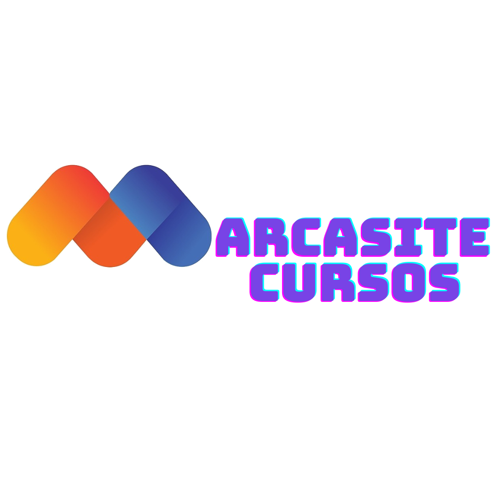

<p align="center">
    <a href="https://marcasite.com.br/" target="_blank">
    
    </a>
</p>

<p align="center">
<a href="https://www.php.net/">
    
</a>
<a href="https://laravel.com/">
    
</a>
<a href="https://br.vuejs.org/">
    
</a>
<a href="https://www.mysql.com/">
    
</a>
<a href="https://tailwindcss.com/">
    
</a>
<a href="https://stripe.com/br">
    
</a>
</p>

## Sobre o projeto

Esse projeto foi desenvolvido como um desafio tecnico para a empresa [Marcasite](https://marcasite.com.br/), e aqui está o resultado de todo esse trajeto de mais ou menos 5 dias de trabalho e estudos desde o zero até a produção.

## Habilidades Desenvolvidas

-   PHP, Laravel, Vuejs e Inertiajs

### Vamos ao que interessa

## Requisitos:

-   Docker -> Pois foi um projeto desenvolvido em cima do pacote Sail do Laravel
-   Laravel Sail
-   Php -> Utilizei a ultima versão, mas qualquer versão que o laravel consiga rodar o Sail ira cuidar do resto!
-   npm -> Essa imagem já vem então não se preocupe com essa parte

## Instalação:

Clone esse repositorio.

```git
git clone git@github.com:odmrs/project-marcasite-courses.git
```

Confira se você já está rodando alguma imagem docker, caso estiver rodando uma, drop ela para não causar conflitos com a imagem sail desse repositorio.

```docker
docker ps
```

Rode um esse comando para o sail buildar tudo que ira precisar.

```sail
sail build
```

Suba a imagem docker.

```sail
sail up -d
```

Confira se tem alguma atualização com.

```sail
sail composer install
```

E por ultimo suba o servidor inertiajs, antes confira se tem algo para atualizar.

```sail
sail npm install
sail npm run dev
```

## Como usar

Por padrão gerei uma seed no banco de dados que vai gerar 3 cursos, 2 usuarios para testes, sendo eles:

-   email: root@root senha: root@root
-   email: user@user senha: user@user

Zere o banco de dados e rode as seeders para uma expêriencia real.

```sail
sail artisan migrate:refresh
sail artisan db:seed
```

Cada usuario tem suas telas, e suas permissoes, para criar novos cursos, ou alunos, ou até mesmo efeturar pagamentos é so acessar cada tela disponivel, está bem intuitivo os botoes e para que serve cada coisa.

O que ira disponibilizar toda a tabela, caso queria baixar tabelas em especifico, filtre através do campo de busca pelo nome ou por categoria.

No campo superior direito você pode editar informações do seu perfil.

### Administradores

Você pode exportar a tabela de usuarios para PDF e para XLS (formato para o EXCEL).

Atenção -> Ao criar um novo estudante irá gerar automaticamente um login com o email e senha que você colocou no formulario.

Na criação de novos cursos você pode modificar qualquer campo, e escolher caso você queira disponibilizar material ou não, isso ficará disponivel para download para o aluno, aceitando a maioria dos formatos que você irá precisar.

Para administradores vocês podem editar e excluir qualquer coisa que te der vontade.

Para administradores vocês podem criar novos usuarios ou novos administradores.

### Usuarios

-   Para testes vocês podem usar o email e senha padrão de usuarios colocado na seção anterior

Para quitar sua pendencia nos cursos aperte no botão pagar agora.

Ira abrir uma tela de checkout onde você pode colocar o seu cartão de testes sandbox que a stripe disponibiliza.

Como por exemplo:

```
Número do Cartão
4242 4242 4242 4242

Validade
MM/AA -> qualquer data futura.

CVC -> 3 números, qualquer um.

```

Caso de tudo certo você será redirecionado para a tela de aprovação, se não,
voce iŕa para a tela de cancelamento, onde você pode voltar e repetir o processo.

## Pessoal: Parte para contar um pouco sobre essa expêriencia

Foi um desafio muito divertido de fazer, aprendi três framework em 5 dias, só fazendo esse projeto, mostrando que tenho uma capacidade enorme de aprendizado rápido e força de vontade, estou muito realizado em entregar esse projeto até mesmo antes do prazo, com tanto amor, carinho, e dedicação!

Unica parte negativa foi de utilizar o inertiajs, o que dificultou mais do que ajudou, mas não tem problema, mais uma skill desenvolvida!!

## Contribuição

Se você achar esse projeto legal e quer seguir em frente com ele me chama no linkedin, ou por aqui mesmo e vamos nessa!
